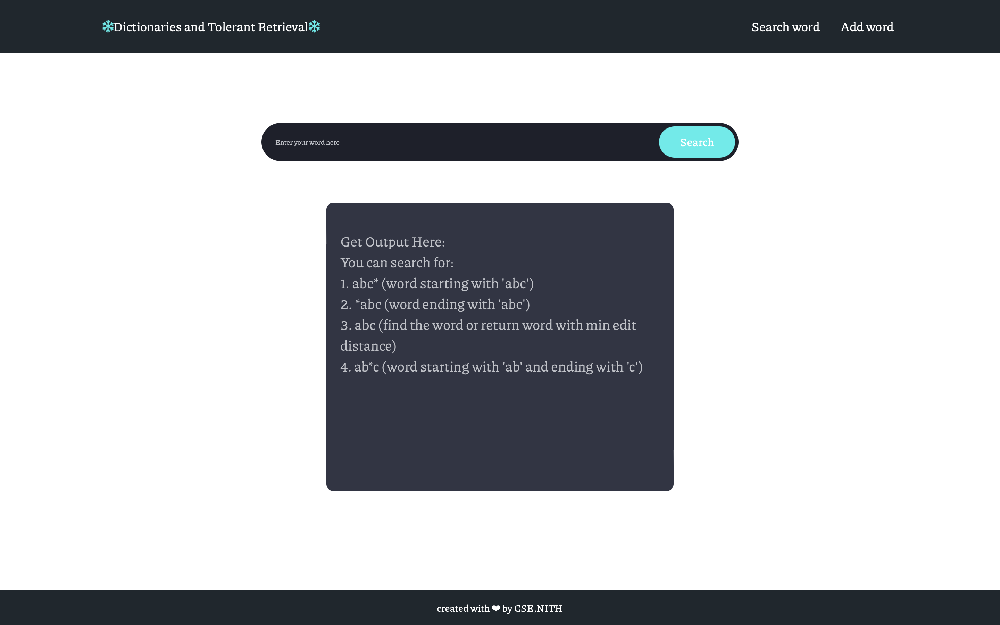

# Dictionaries and Tolerant Retrieval

## Functionality:
        1. *abc (word ending with abc).
        2. abc* (word starting with abc).
        3. abc  (find the word or return word with minimun edit distance).
        4. ab*c (word ending with 'c' and starting with 'ab').
        5. Adding word to dictionary.

## Run:
        * Backend is deployed on heroku (http://still-stream-79080.herokuapp.com)
        * Make a GET request on above url with /query?word=a* of /addstr?word=newword
        * To run locally use $ go run main.go
        * $ node app.js

## Technology used :
    1. Nodejs
    2. Golang
    3. HTML CSS
    4. File DB

## ALgorithms:
    1. Knuth–Morris–Pratt algorithm
    2. Trie
    3. HashMap
    4. Edit-Distance (DP)

